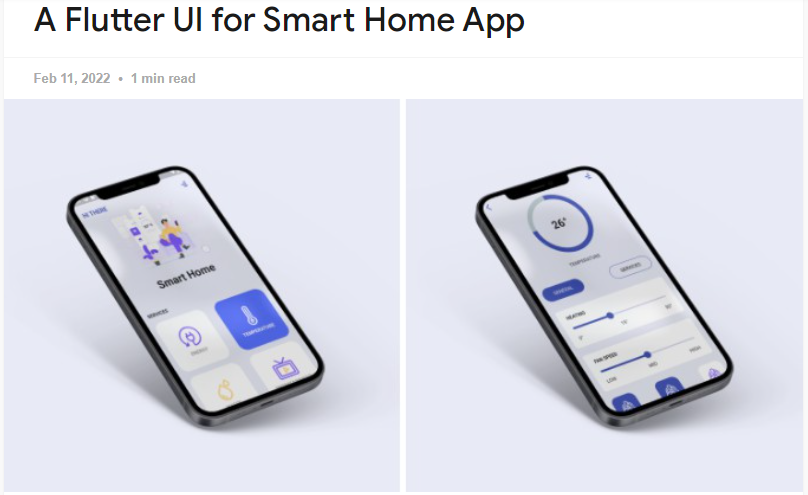

# Aplicativo Smart Home - Projeto Flutter

## Descrição do projeto
Desenvolvido como parte essencial do currículo da disciplina de Desenvolvimento de Dispositivos Móveis, este projeto representa um estudo de caso prático voltado à exploração de conceitos em design de interface, navegação, gestão de estado e interação em dispositivos móveis por meio do framework Flutter. Ele consiste em um aplicativo de casa inteligente (Smart Home) que permite ao usuário controlar e monitorar dispositivos conectados de uma residência por meio de uma interface amigável e intuitiva. O aplicativo oferece funcionalidades de controle de temperatura e velocidade do ar condicionado, além de monitoramento e gestão de energia, água e entretenimento.

O design da interface do aplicativo foi concebido com inspiração em mockups encontrados na internet, que fornecem diretrizes iniciais para o layout e a estética. Estes mockups, disponível em  ([link](https://flutterawesome.com/a-flutter-ui-for-smart-home-app/)), foram essenciais para moldar a estrutura visual do aplicativo, contribuindo para uma experiência de usuário integrada e intuitiva.

**Nota de Desenvolvimento:** Este aplicativo serve como um protótipo para fins educacionais e de demonstração. As funcionalidades relacionadas ao Controle de Energia, Água e Entretenimento são apresentadas como conceitos visuais hipotéticos e servem para demonstrar expansões potenciais futuras do aplicativo, atualmente, não possuem implementações funcionais.

## Objetivos de Aprendizado
- **Layout**: Praticar a criação de interfaces de usuário, com o uso de widgets como `Scaffold`, `Container`, `Column`, `Row`, `Image`, entre outros para acomodar todos os elementos da UI de maneira lógica conforme o design preestabelecido.
- **Navegação e Rotas**: Implementação da navegação entre telas utilizando o widget `Navigator`. Entender como gerenciar rotas de maneira eficaz, permitindo uma experiência de usuário suave e intuitiva ao transitar entre as funcionalidades oferecidas pelo aplicativo.
- **Gerenciamento de Estado**: Aprender a gerenciar o estado das configurações de temperatura e velocidade do ventilador com `StatefulWidget` e o uso de `setState`.
- **Reusabilidade de Componentes**: Desenvolver componentes reutilizáveis para melhorar o código e facilitar a manutenção.
- **Interação com o Usuário**: Criar interfaces interativas que respondam às ações do usuário, como toques e deslizes.

## Funcionalidades por Tela
### Tela Inicial (Smart Home Page)
- **Boas-vindas ao Usuário**: Exibe uma saudação personalizada no topo da tela.
- **Menu**: Ícone de menu no canto superior que poderá abrir uma navegação lateral (opção apenas visual, funcionalidade não implementada).
- **Controle de Serviços**: Botões hipotéticos (exceto `TEMPERATURA`) que levariam às telas específicas de cada serviço (Energia, Temperatura, Água, Entretenimento).

### Tela de Controle de Temperatura
- **Voltar para Home**: Ícone para voltar à tela inicial.
- **Indicador de Temperatura**: Um indicador circular que mostra a temperatura atual.
- **Controle de Temperatura**: Um controle deslizante que permite ao usuário ajustar a configuração de temperatura.
- **Controle de Velocidade do Ventilador**: Um controle deslizante para ajustar a velocidade do ventilador.
- **Abas de Navegação Interna**: Opções para alternar entre controles gerais e específicos dos serviços de temperatura (não funcionais).

## Estrutura do Projeto
O código-fonte do Flutter é modularizado em arquivos separados para cada aspecto do aplicativo.
- `lib/`
    - `constants.dart`: Define as cores e outras constantes usadas na UI.
    - `controller.dart`: Dedicado ao controle do sistema de ar-condicionado da residência.
    - `home_page.dart`: Tela inicial com os controles de serviço.
    - `main.dart`: Ponto de entrada do aplicativo.
    - `services.dart`: Widgets para os cartões de serviço na tela inicial.
    - `temperature.dart`: Tela para controle de temperatura e velocidade do ventilador.
- `images/`: Contém os recursos visuais utilizados no aplicativo.

## Como executar/importar o projeto
1. **Verifique as versões do Flutter e Dart**: Use os comandos `flutter --version` e `dart --version` para confirmar as versões.
2. **Configuração do Ambiente de Desenvolvimento**: No IntelliJ, instale o plugin do Flutter em `File > Settings > Plugins`.
3. **Importação do Projeto**: Em `File > Open`, selecione a pasta do projeto.
4. **Instalação de Dependências**: Execute `flutter pub get` no terminal para instalar dependências.
5. **Execução do Projeto**: Use o botão 'Run' ou o atalho `Shift + F10`.

### Observações
- Assegure-se de que o dispositivo ou emulador esteja rodando uma versão compatível com a versão do Flutter usada.
- Consulte a [documentação oficial do Flutter](https://docs.flutter.dev) para soluções de problemas.

